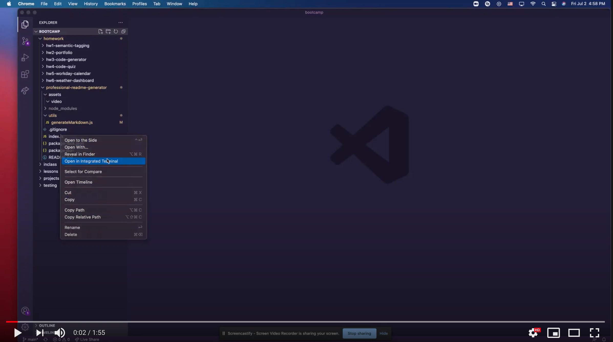

# Professional README File Generator

[]()

# Description

This app is a README File Generator. 

## Demo of the app

(Click on the image below to be redirected to Youtube demo video)

[](https://www.youtube.com/watch?v=T51TT_0I3-I)


# Table of Contents

* [Installation](#installation)
    
* [Usage](#usage)

* [Technology](#technology)

* [License](#license)

* [Contributors](#contributors)

* [Questions](#questions)

# Installation

The user needs to download the repo and once they have done this they should run the terminal in the root of the folder and type the following command:

```node index.js``` 

Then install the dependencies by running the following command: 

```npm install```

# Usage

After running the command ```node index.js``` in the terminal and installing the dependencies the user will then be prompted with some questions that they must answer and then the README file will be generated.

# Technology

* Inquirer

# License 

This project is governed by: MIT License

# Contributors

Blenda Orellana

# Questions

If you have any questions about the repo or the app please feel free to contact me
 * Email: blen.or90@gmail.com
 * Github: https://github.com/blen90
